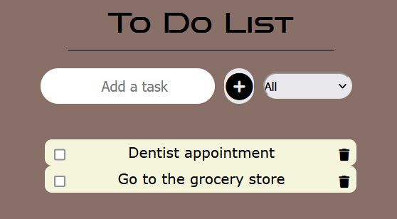

# To Do List
The goal of this exercise was to create a to-do list using what we've learned before :

- Semantic HTML, SCSS
- Usage of BEM Methodology
- Responsive design
- Javascript
- The DOM
- Event listeners

  It's a very simple to do list where you can add or delete a task and sort them

## Screen shot

